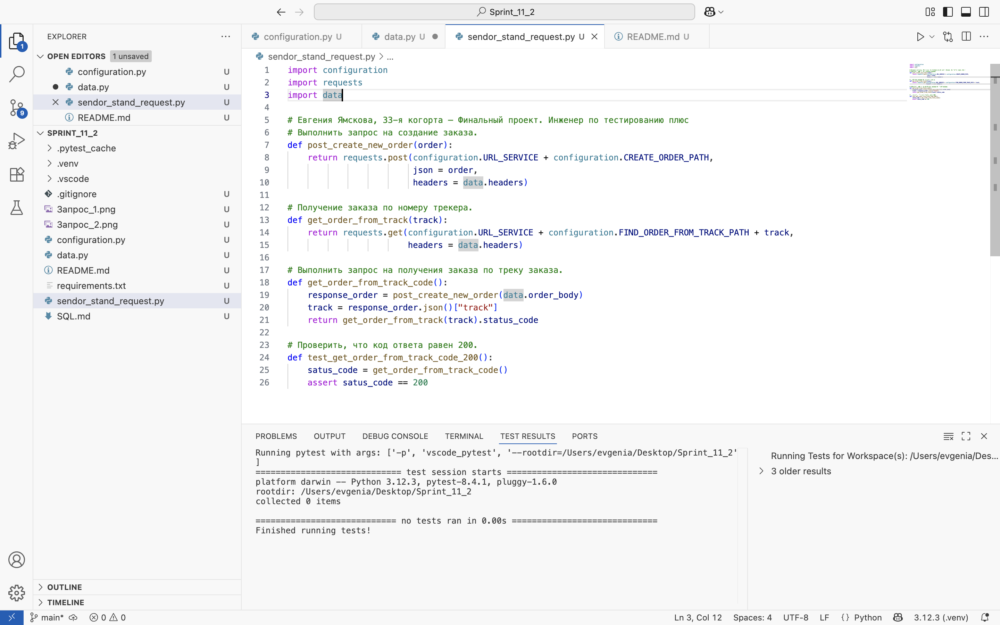

#	Project 11 – Финальный проект
## Автоматизация теста к API
### Автоматизируй сценарий, который подготовили коллеги-тестировщики:
1.	Клиент создает заказ.
2.	Проверяется, что по треку заказа можно получить данные о заказе.
### Шаги автотеста:
```
1. Выполнить запрос на создание заказа.
2. Сохранить номер трека заказа.
3. Выполнить запрос на получения заказа по треку заказа.
4. Проверить, что код ответа равен 200.
```
## Скриншот результата:

### Configuration
*	URL: https://311be941-4a2b-43fd-8e4b-243387aa8ab2.serverhub.praktikum-services.ru.
*	Стэк: VSCode с пакетами: `requests`, `pytest`.