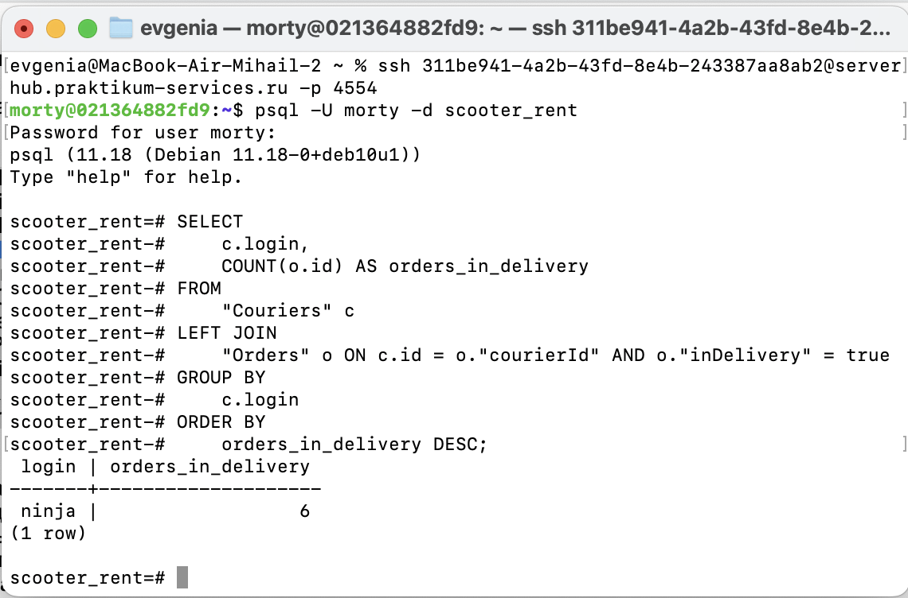
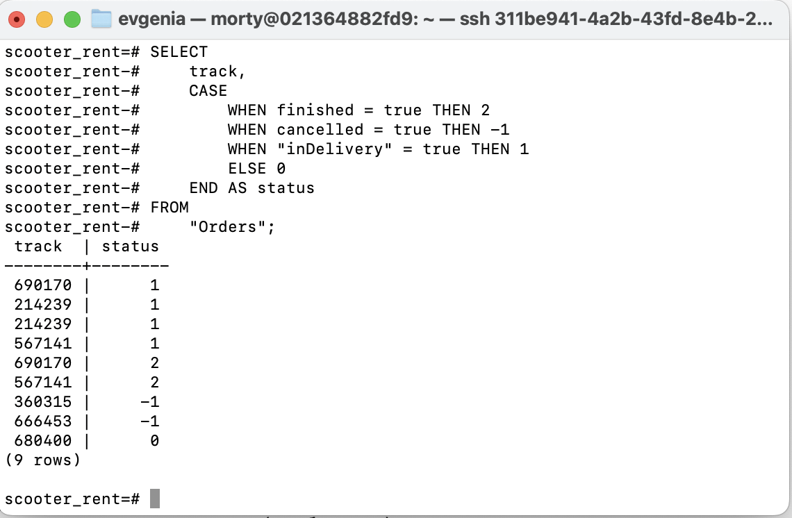

# Работа с базой данных. PostgreSQL

## Задание 1

Представь: тебе нужно проверить, отображается ли созданный заказ в базе данных.
Для этого: выведи список логинов курьеров с количеством их заказов в статусе «В доставке» (поле inDelivery = true). 

SQL-Запрос:
```sql
SELECT 
    c.login,
    COUNT(o.id) AS orders_in_delivery
FROM 
    "Couriers" c
LEFT JOIN 
    "Orders" o ON c.id = o."courierId" AND o."inDelivery" = true
GROUP BY 
    c.login
ORDER BY 
    orders_in_delivery DESC;
```

## Скриншот:


## Задание 2

Ты тестируешь статусы заказов. Нужно убедиться, что в базе данных они записываются корректно.
Для этого: выведи все трекеры заказов и их статусы. 
Статусы определяются по следующему правилу:
```
Если поле finished == true, то вывести статус 2.
Если поле canсelled == true, то вывести статус -1.
Если поле inDelivery == true, то вывести статус 1.
Для остальных случаев вывести 0.
```

SQL-Запрос:
```sql
SELECT 
    track,
    CASE 
        WHEN finished = true THEN 2
        WHEN cancelled = true THEN -1
        WHEN "inDelivery" = true THEN 1
        ELSE 0
    END AS status
FROM 
    "Orders";
```

## Скриншот:
